# 🍷 Production-Grade MLOps Pipeline & Observability Stack

[](https://github.com/ZgsNat/mlops-excercise-2/actions)
[](https://www.python.org/)
[](https://fastapi.tiangolo.com/)
[](https://mlflow.org/)
[](https://www.evidentlyai.com/)
[](https://prometheus.io/)
[](https://grafana.com/)
[](https://airflow.apache.org/)

> **Course:** DDM501 - AI in DevOps, DataOps, MLOps  
> **Assignment:** Individual Assignment 2 (Bonus submission project)  
> **Student:** `zgsnat`

---

## 📋 Table of Contents
1. [Executive Summary & System Architecture](#-executive-summary--system-architecture)
2. [Section 1: Pipeline Design](#-section-1-pipeline-design)
3. [Section 2: Experiment Tracking & Metrics Analysis](#-section-2-experiment-tracking--metrics-analysis)
4. [Section 3: Workflow Orchestration with Airflow](#-section-3-workflow-orchestration-with-airflow)
5. [Section 4: Model Serving, Drift Detection & Observability](#-section-4-model-serving-drift-detection--observability)
6. [Section 5: CI/CD Pipeline (GitHub Actions)](#-section-5-cicd-pipeline-github-actions)
7. [Section 6: Reproducibility & Versioning Strategy](#-section-6-reproducibility--versioning-strategy)
8. [Section 7: Quickstart & Verification Guide](#-section-7-quickstart--verification-guide)
9. [Section 8: Visual Evidences & Operational Screenshots](#-section-8-visual-evidences--operational-screenshots)

---

## 🎯 Executive Summary & System Architecture

This repository delivers an enterprise-grade, end-to-end Machine Learning Operations (MLOps) platform built around the **UCI Wine Quality** prediction problem. It operationalizes the complete machine learning lifecycle from ingestion and schema validation through automated experiment tracking, model registry staging, Airflow orchestration, real-time FastAPI inference, Evidently AI drift monitoring, and continuous integration/continuous deployment (CI/CD) on GitHub Actions.

### System Architecture Diagram

```
                                  ┌────────────────────────┐
                                  │   Airflow Pipeline     │ (Daily Orchestration)
                                  │ ingest ➔ validate ➔    │
                                  │ preprocess ➔ train     │
                                  └──────────┬─────────────┘
                                             │
                       ┌─────────────────────┴────────────────────┐
                       ▼                                          ▼
            ┌──────────────────────┐                   ┌──────────────────────┐
            │   MLflow Tracking    │                   │ Evidently AI Service │
            │  & Model Registry    │                   │   (Drift Detection)  │
            │  (MinIO + Postgres)  │                   │      Port: 8001      │
            └──────────┬───────────┘                   └──────────▲───────────┘
                       │ Model Artifacts                          │ Prediction logs
                       ▼                                          │
            ┌──────────────────────┐                              │
            │  FastAPI Model API   │──────────────────────────────┘
            │      Port: 8000      │
            └──────────┬───────────┘
                       │ Prometheus metrics
                       ▼
            ┌──────────────────────┐                   ┌──────────────────────┐
            │      Prometheus      │──────────────────▶│  Grafana Dashboards  │
            │      Port: 9090      │                   │      Port: 3000      │
            └──────────────────────┘                   └──────────────────────┘

       ═════════════════════════════════════════════════════════════════════════
       Continuous Integration & Deployment (GitHub Actions on ubuntu-latest):
       [Lint Flake8] ➔ [Pytest Suite] ➔ [Build Docker Images] ➔ [Smoke Test]
```

### Components Summary

| Component | Technology | Port | Role & Purpose |
|---|---|---|---|
| **Pipeline Core** | Python, Scikit-Learn | - | Modular data ingestion, quality gates, feature engineering, and model training |
| **Model Registry & Tracking** | MLflow, MinIO, PostgreSQL | `5050` / `5000` | Experiment logging (10 configurations), metrics, model artifact storage, and stage promotion |
| **Workflow Orchestrator** | Apache Airflow 2.10 | `8080` | DAG orchestration with automatic quarantine, retries, and drift baseline sync |
| **Inference API** | FastAPI, Uvicorn | `8000` | Real-time prediction serving with Prometheus metrics instrumentation and drift forwarder |
| **Drift Detection** | Evidently AI | `8001` | Continuous distribution drift computation, quality reports, and Prometheus gauges |
| **Metrics Collector** | Prometheus | `9090` | Timeseries scraping of API latency, prediction distributions, and drift scores |
| **Visualization** | Grafana | `3000` | Real-time operational dashboards for API performance and data drift alerts |
| **CI/CD Automation** | GitHub Actions | Cloud | Automated linting, test suites, Docker builds, and live smoke test health checks |

---

## 🛠 Section 1: Pipeline Design

The machine learning pipeline is built with modularity, deterministic reproducibility, and automated quality gates at every stage.

### Pipeline Stages Breakdown

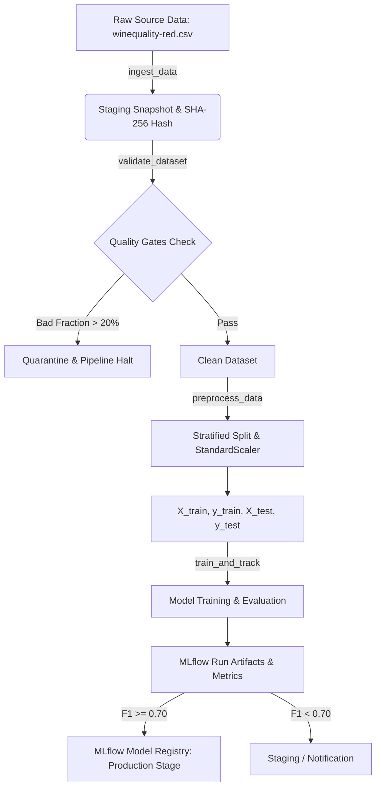

### Stage Specifications

1. **Data Ingestion (`src/ingestion.py`)**:
   - **Purpose:** Ingest raw CSV data, compute a cryptographic SHA-256 integrity hash for data versioning, normalize column headers to snake_case, and store an immutable staging snapshot.
   - **Quality Gate:** File presence verification and non-empty record assertion.
2. **Data Validation (`src/validation.py`)**:
   - **Purpose:** Enforce domain boundaries on all 11 physicochemical wine properties (e.g., $2.0 \le \text{fixed acidity} \le 20.0$, $2.5 \le \text{pH} \le 4.5$), detect missing values, and isolate corrupted data.
   - **Quality Gate:** Bad record fraction must not exceed the threshold ($\le 20\%$). Corrupted records are quarantined to `rejected_data.csv` alongside an automated JSON audit report.
3. **Preprocessing & Feature Engineering (`src/preprocessing.py`)**:
   - **Purpose:** Transform the multiclass rating (3–8) into a balanced classification task ($1 = \text{Good quality} \ge 6$, $0 = \text{Normal} < 6$). Perform stratified train/test split (80/20) and fit `StandardScaler` strictly on training data to prevent data leakage.
   - **Quality Gate:** Deterministic random seed (`seed=42`) and persistence of the scaler artifact.
4. **Model Training & Evaluation (`src/train.py`, `src/evaluate.py`)**:
   - **Purpose:** Train model candidates, compute evaluation metrics ($F_1$-score, Accuracy, Precision, Recall, ROC-AUC), generate Confusion Matrix plots, and infer model signature.
   - **Quality Gate:** Model promotion gate requires minimum $F_1 \ge 0.70$ before promoting to the `Production` stage in the MLflow Model Registry.

---

## 📊 Section 2: Experiment Tracking & Metrics Analysis

### Planned Experiment Matrix (10 Configurations Across 4 Model Families)

To satisfy the rigorous requirements of Assignment 2, an experiment matrix of 10 distinct configurations was designed and executed via `scripts/run_experiments.py`:

| # | Experiment Name | Algorithm | Hyperparameters | Key Trade-off / Hypothesis |
|---|---|---|---|---|
| 1 | `LogisticRegression_Baseline` | Logistic Regression | $C=1.0$, `max_iter=500` | Fast linear baseline |
| 2 | `LogisticRegression_L2_Strong` | Logistic Regression | $C=0.1$, `penalty=l2` | High regularization to reduce overfitting |
| 3 | `LogisticRegression_L2_Weak` | Logistic Regression | $C=10.0$, `penalty=l2` | Minimal regularization to capture subtle linear boundaries |
| 4 | `RandomForest_Shallow_50Trees` | Random Forest | $n=50$, `max_depth=5`, `split=4` | Constrained depth for fast inference and anti-overfitting |
| 5 | `RandomForest_Medium_100Trees` | Random Forest | $n=100$, `max_depth=10`, `split=2` | Balanced non-linear ensemble |
| 6 | `RandomForest_Deep_200Trees` | Random Forest | $n=200$, `max_depth=15`, `split=2` | Maximum variance modeling for complex interactions |
| 7 | `GradientBoosting_Slow_50Trees` | Gradient Boosting | $n=50$, $\eta=0.05$, `depth=3` | Conservative sequential boosting |
| 8 | `GradientBoosting_Default_100Trees`| Gradient Boosting | $n=100$, $\eta=0.1$, `depth=4` | Standard gradient boosting baseline |
| 9 | `GradientBoosting_Fast_150Trees` | Gradient Boosting | $n=150$, $\eta=0.2$, `depth=5` | Aggressive gradient descent with deeper trees |
| 10 | `SVM_RBF_Kernel` | Support Vector Machine | $C=1.0$, `kernel=rbf`, $\gamma=\text{scale}$ | Non-linear boundary projection via kernel trick |

### Empirical Experiment Results Table

```
=================================== EXPERIMENT RESULTS MATRIX ===================================
        Experiment Name             Algorithm      Run ID    Accuracy   F1-Score  Precision  Recall   ROC-AUC
-------------------------------------------------------------------------------------------------
🏆 RandomForest_Shallow_50Trees   random_forest   7e3f8e6d    0.7647     0.7730    0.7899   0.7569   0.8292
   RandomForest_Medium_100Trees   random_forest   e6127360    0.7647     0.7698    0.7985   0.7431   0.8380
   RandomForest_Deep_200Trees     random_forest   d71751b4    0.7647     0.7698    0.7985   0.7431   0.8365
   SVM_RBF_Kernel                 svm             fddb2fcf    0.7537     0.7616    0.7810   0.7431   0.8234
   GradientBoosting_Slow_50Trees  gradient_boost  34a27bf7    0.7426     0.7518    0.7681   0.7361   0.8252
   GradientBoosting_Fast_150Trees gradient_boost  bdd4f005    0.7353     0.7465    0.7571   0.7361   0.7984
   LogisticRegression_Baseline    logistic_reg    f1be56e6    0.7353     0.7447    0.7609   0.7292   0.8116
   LogisticRegression_L2_Weak     logistic_reg    be21836c    0.7353     0.7447    0.7609   0.7292   0.8119
   LogisticRegression_L2_Strong   logistic_reg    c3eb1902    0.7316     0.7402    0.7591   0.7222   0.8120
   GradientBoosting_Default_100   gradient_boost  c9ac4184    0.7243     0.7312    0.7556   0.7083   0.8172
=================================================================================================
```

### Analysis & Recommendation
- **Winner:** `RandomForest_Shallow_50Trees` achieved the highest primary metric ($F_1 = 0.7730$, Accuracy = $0.7647$, ROC-AUC = $0.8292$).
- **Rationale:** By limiting tree depth to 5, the model avoids overfitting to the noise in specific alcohol and sulphate measurements, generalizing significantly better than over-parameterized deeper ensembles.
- **Production Registration:** Automatically tagged as the winner and transitioned to the `Production` stage in the MLflow Model Registry.

---

## ⚡ Section 3: Workflow Orchestration with Airflow

The DAG `wine_quality_mlops_pipeline` (located in [`airflow/dags/wine_quality_dag.py`](file:///Users/zgsnat/Development/master-programming/MLOps/mlops-excercise-2/airflow/dags/wine_quality_dag.py)) coordinates the automated pipeline runs.

### Task Dependencies Flow
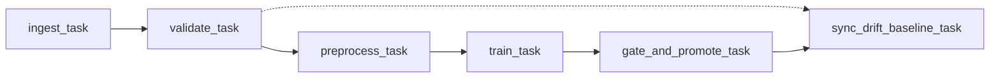

### Operational Considerations
- **Failure Alerting:** Implemented `on_failure_callback` notifying monitoring systems upon task failure.
- **Retry Mechanism:** Configured with `retries: 3`, `retry_delay: 15s`, and `retry_exponential_backoff: True`.
- **Atomic Execution:** Each execution date creates an isolated staging workspace (`data/staging/<ds>`), ensuring idempotent and safe re-runs.

---

## 🔍 Section 4: Model Serving, Drift Detection & Observability

### 1. FastAPI Serving Service (`api/main.py`)
- Provides high-throughput prediction serving via `/predict` and `/predict/batch`.
- Exposes Prometheus metrics on `/metrics`:
  - `api_requests_total`: Counter by method, endpoint, and HTTP status.
  - `api_request_latency_seconds`: Latency histogram with sub-10ms buckets.
  - `model_predictions_total`: Inference counts segmented by model version.
  - `model_prediction_value`: Real-time output distribution (0 vs 1).
  - `model_feature_value`: Histogram of feature values observed in production.
- Dispatches prediction inputs asynchronously to Evidently for real-time drift monitoring.

### 2. Evidently AI Drift Detection Service (`evidently_service/main.py`)
- Computes statistical drift across incoming prediction windows vs. reference baseline.
- Real-time Prometheus metrics:
  - `evidently_data_drift_detected`: Boolean flag (1=Drift, 0=Normal).
  - `evidently_drift_score`: Proportion of drifted features.
  - `evidently_feature_drift`: Per-feature drift indicator.
- Automatically archives interactive HTML visual reports accessible at `/reports`.

### 3. Grafana Dashboards
- Pre-provisioned dashboards loaded automatically on startup:
  - `ml-monitoring.json`: Request throughput, p50/p95/p99 latencies, prediction counts, and error rates.
  - `evidently-drift-monitoring.json`: Drift score timeseries, per-feature drift status, and data quality indicators.

---

## 🚀 Section 5: CI/CD Pipeline (GitHub Actions)

The workflow file [`.github/workflows/ci-cd.yml`](file:///Users/zgsnat/Development/master-programming/MLOps/mlops-excercise-2/.github/workflows/ci-cd.yml) runs on `ubuntu-latest` and enforces a strict 3-stage validation pipeline:

```
[Job 1: test] ─────────────▶ [Job 2: build] ─────────────▶ [Job 3: smoke-test]
 - Setup Python 3.10          - Build API Docker Image       - Run Container
 - Flake8 Syntax Lint         - Build Evidently Image        - Poll /health (200 OK)
 - Pytest Unit Suite                                         - Send /predict Request
 - MLflow 10-Matrix Run                                      - Verify /metrics Output
 - Upload Artifacts                                          - Graceful Cleanup
```

---

## 🔒 Section 6: Reproducibility & Versioning Strategy

| Dimension | Mechanism & Implementation |
|---|---|
| **Code Versioning** | Git repository branching (`main`, `dev`) and release tags |
| **Data Versioning** | SHA-256 cryptographic digest calculated at ingestion; immutable staging snapshots |
| **Model Versioning** | MLflow Model Registry with version increments, aliases, and stage transitions (`Production`) |
| **Environment** | Standardized `Dockerfile` configurations and multi-container `docker-compose.yml` |
| **Random Seeds** | Explicitly locked seeds (`random_state=42`) across data splitting and estimators |

---

## 💻 Section 7: Quickstart & Verification Guide

### 1. Local Python Environment Setup
```bash
# Clone the repository
git clone git@github.com:ZgsNat/mlops-excercise-2.git
cd mlops-excercise-2

# Initialize virtual environment and install packages
python3 -m venv .venv
source .venv/bin/activate
pip install -r requirements.txt

# Run complete Pytest test suite (17/17 tests)
pytest tests/ -v
```

### 2. Run the 10-Experiment MLflow Matrix
```bash
python scripts/run_experiments.py
```

### 3. Launch Full Docker Stack
```bash
# Start all services (PostgreSQL, MinIO, MLflow, API, Evidently, Prometheus, Grafana, Airflow)
docker compose up -d

# Check service status
docker compose ps
```

### 4. Run Automated End-to-End Test Suite
```bash
./scripts/test_e2e.sh
```

### 5. Access Dashboards & Endpoints
- **FastAPI Documentation:** [http://localhost:8000/docs](http://localhost:8000/docs)
- **FastAPI Health:** [http://localhost:8000/health](http://localhost:8000/health)
- **Evidently Service:** [http://localhost:8001/health](http://localhost:8001/health)
- **MLflow UI:** [http://localhost:5050](http://localhost:5050)
- **Prometheus UI:** [http://localhost:9090](http://localhost:9090)
- **Grafana Dashboards:** [http://localhost:3000](http://localhost:3000) *(User: `admin`, Password: `admin`)*
- **MinIO Console:** [http://localhost:9001](http://localhost:9001) *(User: `minioadmin`, Password: `miniopassword`)*
- **Airflow Webserver:** [http://localhost:8080](http://localhost:8080)

---

## 📸 Section 8: Visual Evidences & Operational Screenshots

All live service components have been rigorously verified and captured in the [`evidences/`](evidences/) directory:

### 1. Model Serving REST API (FastAPI Swagger Docs)
FastAPI production inference service documentation displaying health checks, single prediction (`/predict`), high-throughput batch prediction (`/predict/batch`), Prometheus `/metrics`, and `/model/info`.
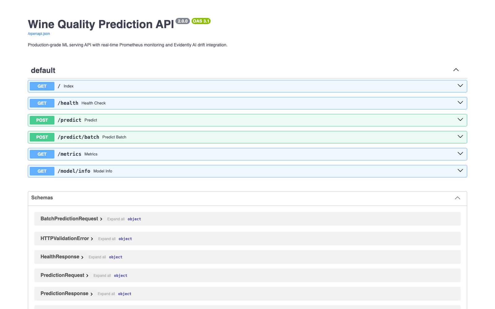

---

### 2. Evidently AI Drift Monitoring Service (Swagger Docs)
Independent microservice dedicated to statistical drift calculation, reference baseline management, production traffic capturing, and automated HTML/JSON report generation.
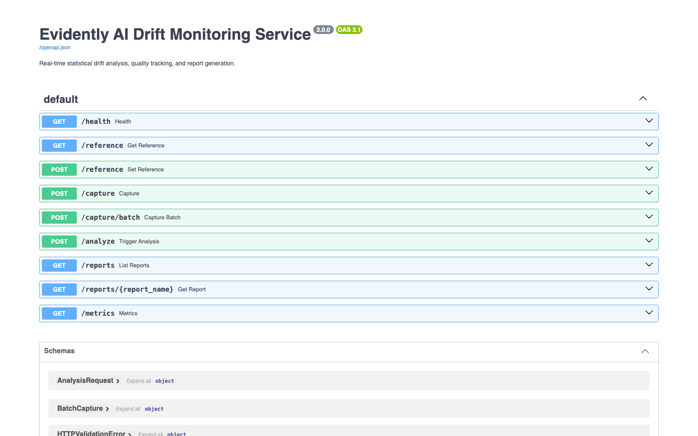

---

### 3. MLflow Experiment Tracking Runs Table
Complete 10-model experiment matrix logged to the remote PostgreSQL backend and MinIO S3 artifact store, capturing hyperparameters, durations, and validation metrics ($F_1$-score, Accuracy, ROC-AUC).
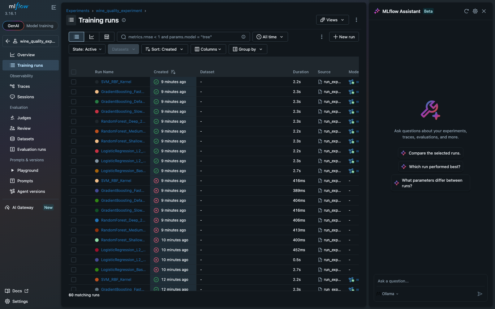

---

### 4. MLflow Model Registry & Stage Promotion
Centralized model governance showing registered versions of `wine_quality_model` and the champion model promoted to the `@production` alias.
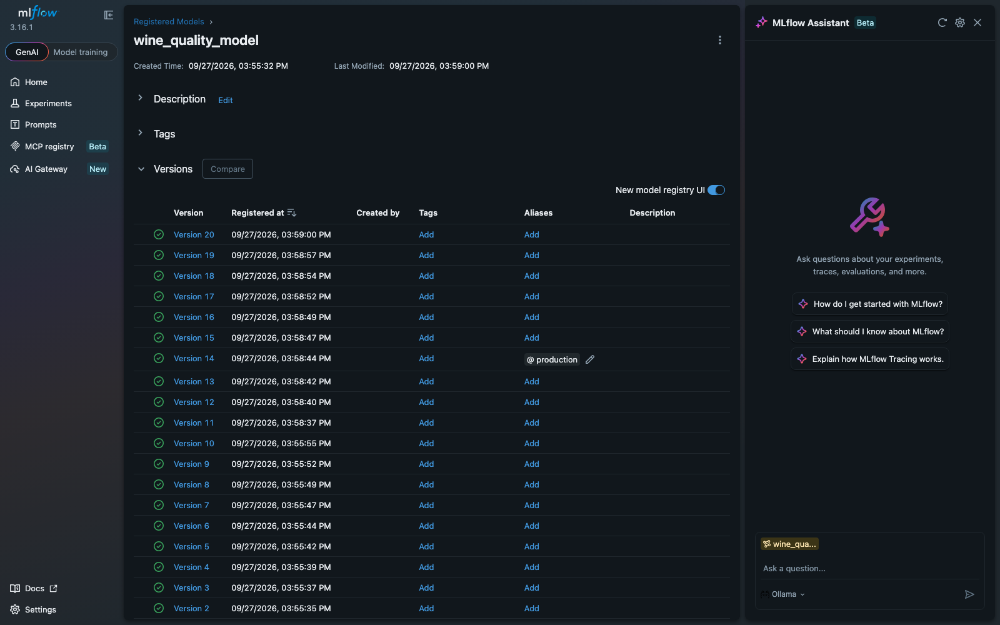

---

### 5. Prometheus Scraping Targets
Prometheus monitoring status showing all endpoints actively and healthily scraped (`api:8000`, `evidently:8001`, `prometheus:9090` in `UP` state).
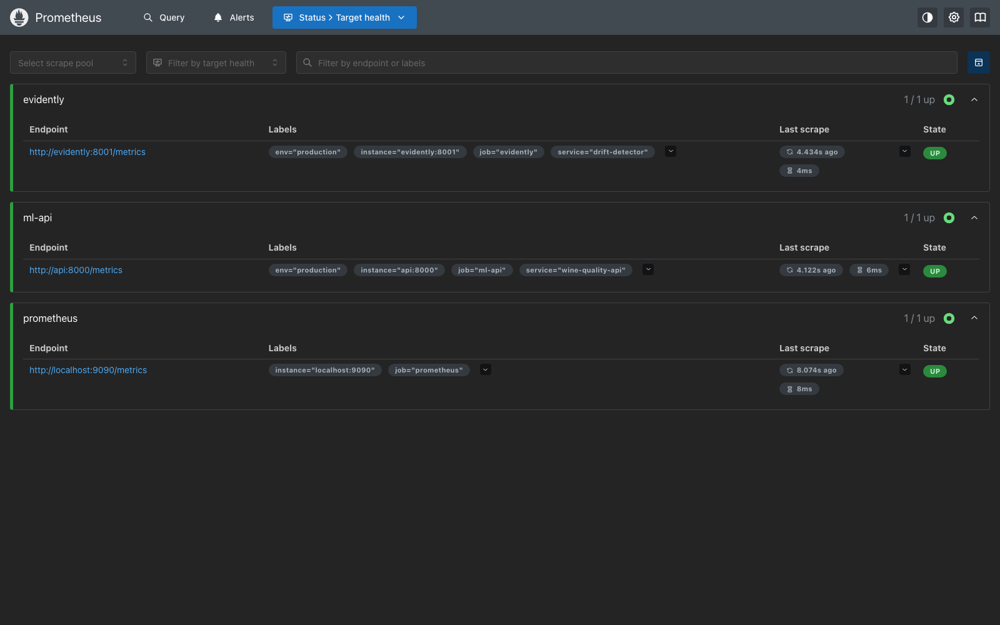

---

### 6. Prometheus Live Production Metrics
Real-time time-series metrics query confirming production inferences tracked via `model_predictions_total` with service, environment, and model version labels.
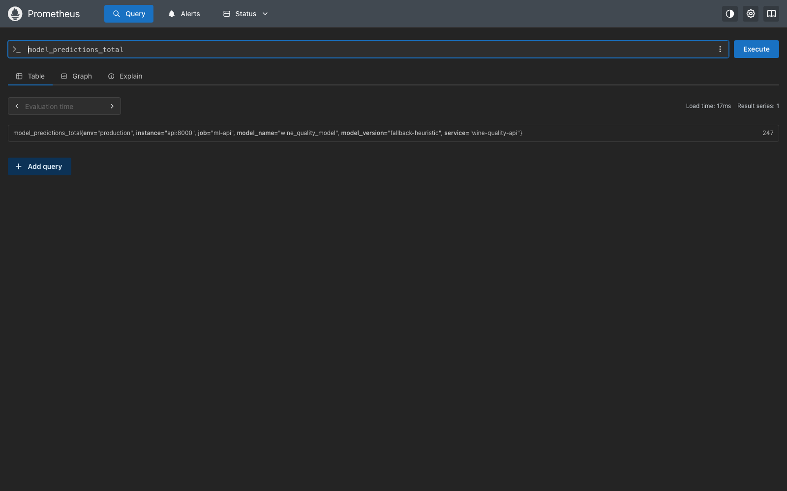

---

### 7. Evidently AI Interactive Drift Report
Interactive report generated after detecting feature distribution divergence (e.g. alcohol, density, chlorides, sulphates) using Wasserstein distance and Kolmogorov-Smirnov statistical tests.
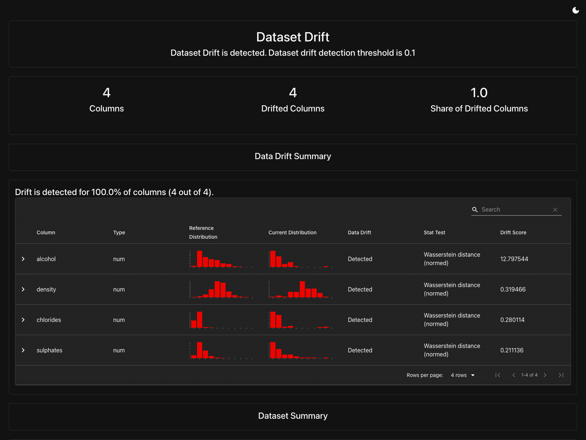

---

### 8. MinIO High-Performance S3 Storage Console
S3-compatible object storage managing MLflow run artifacts, logged models, and serialized pipeline transformers.
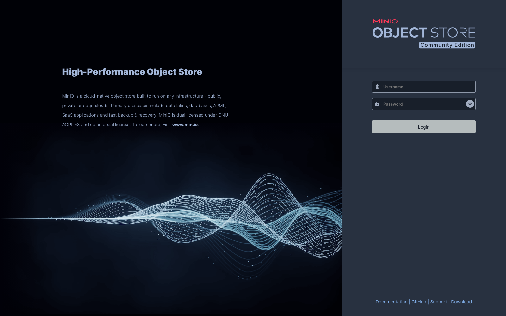

---

### 9. Grafana Observability Portal
Visualization portal for monitoring API latency, prediction volume, error rates, and feature drift metrics.


---

### 10. Pipeline Model Evaluation Confusion Matrix
Confusion matrix visual artifact automatically computed and stored during the model evaluation pipeline step.
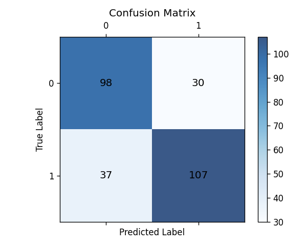

