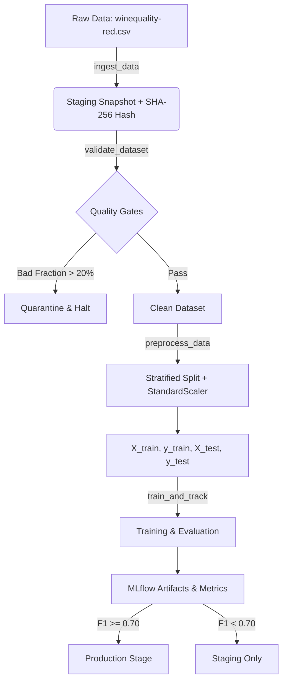
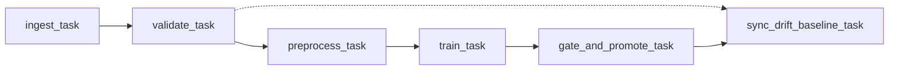

# MLOps Pipeline - Wine Quality Prediction

[](https://github.com/vu25ms13298-oss/mlops-excercise-2-vu25ms13298/actions)
[](https://www.python.org/)
[](https://fastapi.tiangolo.com/)
[](https://mlflow.org/)
[](https://www.evidentlyai.com/)
[](https://prometheus.io/)
[](https://grafana.com/)
[](https://airflow.apache.org/)

> **Course:** DDM501 - AI in DevOps, DataOps, MLOps  
> **Assignment:** Individual Assignment 2  
> **Student:** `vu25ms13298-oss`

End-to-end MLOps platform for the **UCI Wine Quality** (red wine) classification problem. Covers the full ML lifecycle: data ingestion, validation, experiment tracking, model registry, Airflow orchestration, real-time serving, drift monitoring, and CI/CD.

---

## Table of Contents

1. [System Architecture](#system-architecture)
2. [Pipeline Design](#pipeline-design)
3. [Experiment Tracking](#experiment-tracking)
4. [Workflow Orchestration](#workflow-orchestration)
5. [Model Serving & Observability](#model-serving--observability)
6. [CI/CD Pipeline](#cicd-pipeline)
7. [Reproducibility](#reproducibility)
8. [Quickstart Guide](#quickstart-guide)

---

## System Architecture

```
                                  ┌────────────────────────┐
                                  │   Airflow Pipeline     │ (Daily Orchestration)
                                  │ ingest → validate →    │
                                  │ preprocess → train     │
                                  └──────────┬─────────────┘
                                             │
                       ┌─────────────────────┴────────────────────┐
                       ▼                                          ▼
            ┌──────────────────────┐                   ┌──────────────────────┐
            │   MLflow Tracking    │                   │ Evidently AI Service │
            │  & Model Registry    │                   │   (Drift Detection)  │
            │  (MinIO + Postgres)  │                   │      Port: 8001      │
            └──────────┬───────────┘                   └──────────▲───────────┘
                       │ Model Artifacts                          │ Prediction logs
                       ▼                                          │
            ┌──────────────────────┐                              │
            │  FastAPI Model API   │──────────────────────────────┘
            │      Port: 8000      │
            └──────────┬───────────┘
                       │ Prometheus metrics
                       ▼
            ┌──────────────────────┐                   ┌──────────────────────┐
            │      Prometheus      │──────────────────▶│  Grafana Dashboards  │
            │      Port: 9090      │                   │      Port: 3000      │
            └──────────────────────┘                   └──────────────────────┘

       ═════════════════════════════════════════════════════════════════════════
       CI/CD (GitHub Actions): Lint → Test → Experiments → Docker Build → Smoke Test
```

| Component | Technology | Port | Purpose |
|---|---|---|---|
| Pipeline Core | Python, Scikit-Learn | - | Data ingestion, validation, preprocessing, training |
| Model Registry | MLflow, MinIO, PostgreSQL | `5050` | Experiment logging, model artifact storage, stage promotion |
| Orchestrator | Apache Airflow 2.10 | `8080` | DAG scheduling with retries and drift baseline sync |
| Inference API | FastAPI, Uvicorn | `8000` | Real-time prediction with Prometheus instrumentation |
| Drift Detection | Evidently AI | `8001` | Statistical drift computation and report generation |
| Metrics | Prometheus | `9090` | Time-series scraping of API latency, predictions, drift |
| Dashboards | Grafana | `3000` | Operational dashboards for performance and drift alerts |
| CI/CD | GitHub Actions | Cloud | Linting, tests, Docker builds, smoke tests |

---

## Pipeline Design

The ML pipeline enforces quality gates at every stage to ensure only valid data and performant models reach production.



### Stage Details

| Stage | Module | What it does | Quality Gate |
|---|---|---|---|
| **Ingestion** | [`src/ingestion.py`](src/ingestion.py) | Load CSV, normalize columns to snake_case, compute SHA-256 hash, save staging snapshot | File exists, non-empty |
| **Validation** | [`src/validation.py`](src/validation.py) | Check domain bounds on all 11 features (e.g. 2.0 ≤ fixed_acidity ≤ 20.0), detect nulls, isolate duplicates | Bad fraction ≤ 20%, else quarantine to `rejected_data.csv` |
| **Preprocessing** | [`src/preprocessing.py`](src/preprocessing.py) | Binary target (quality ≥ 6 → Good), stratified 80/20 split, StandardScaler fit on train only | Deterministic seed=42, scaler persisted |
| **Training** | [`src/train.py`](src/train.py), [`src/evaluate.py`](src/evaluate.py) | Train candidates, log params/metrics/artifacts to MLflow, generate confusion matrix | F1 ≥ 0.70 required for Production promotion |

---

## Experiment Tracking

10 configurations across 4 model families, executed via [`scripts/run_experiments.py`](scripts/run_experiments.py):

| # | Experiment | Algorithm | Hyperparameters |
|---|---|---|---|
| 1 | LogisticRegression_Baseline | Logistic Regression | C=1.0, max_iter=500 |
| 2 | LogisticRegression_L2_Strong | Logistic Regression | C=0.1, penalty=l2 |
| 3 | LogisticRegression_L2_Weak | Logistic Regression | C=10.0, penalty=l2 |
| 4 | RandomForest_Shallow_50Trees | Random Forest | n=50, max_depth=5, split=4 |
| 5 | RandomForest_Medium_100Trees | Random Forest | n=100, max_depth=10, split=2 |
| 6 | RandomForest_Deep_200Trees | Random Forest | n=200, max_depth=15, split=2 |
| 7 | GradientBoosting_Slow_50Trees | Gradient Boosting | n=50, lr=0.05, depth=3 |
| 8 | GradientBoosting_Default_100Trees | Gradient Boosting | n=100, lr=0.1, depth=4 |
| 9 | GradientBoosting_Fast_150Trees | Gradient Boosting | n=150, lr=0.2, depth=5 |
| 10 | SVM_RBF_Kernel | SVM | C=1.0, kernel=rbf, gamma=scale |

### Results

| Experiment | Accuracy | F1-Score | Precision | Recall | ROC-AUC |
|---|---|---|---|---|---|
| **RandomForest_Shallow_50Trees** | **0.7647** | **0.7730** | **0.7899** | **0.7569** | **0.8292** |
| RandomForest_Medium_100Trees | 0.7647 | 0.7698 | 0.7985 | 0.7431 | 0.8380 |
| RandomForest_Deep_200Trees | 0.7647 | 0.7698 | 0.7985 | 0.7431 | 0.8365 |
| SVM_RBF_Kernel | 0.7537 | 0.7616 | 0.7810 | 0.7431 | 0.8234 |
| GradientBoosting_Slow_50Trees | 0.7426 | 0.7518 | 0.7681 | 0.7361 | 0.8252 |
| GradientBoosting_Fast_150Trees | 0.7353 | 0.7465 | 0.7571 | 0.7361 | 0.7984 |
| LogisticRegression_Baseline | 0.7353 | 0.7447 | 0.7609 | 0.7292 | 0.8116 |
| LogisticRegression_L2_Weak | 0.7353 | 0.7447 | 0.7609 | 0.7292 | 0.8119 |
| LogisticRegression_L2_Strong | 0.7316 | 0.7402 | 0.7591 | 0.7222 | 0.8120 |
| GradientBoosting_Default_100 | 0.7243 | 0.7312 | 0.7556 | 0.7083 | 0.8172 |

**Winner:** `RandomForest_Shallow_50Trees` (F1 = 0.7730). Limiting tree depth to 5 avoids overfitting while capturing the key feature interactions. Automatically promoted to `Production` in the MLflow Model Registry.

---

## Workflow Orchestration

The Airflow DAG [`wine_quality_mlops_pipeline`](airflow/dags/wine_quality_dag.py) runs daily with the following task chain:



- **Failure alerting** via `on_failure_callback` to monitoring systems
- **Retry mechanism:** 3 retries with 15s delay and exponential backoff
- **Idempotent execution:** each run creates an isolated workspace at `data/staging/<ds>`

---

## Model Serving & Observability

### FastAPI Inference (`api/main.py`)

- `/predict` -- single prediction with confidence score
- `/predict/batch` -- batch inference
- `/metrics` -- Prometheus scrape endpoint exposing:
  - `api_requests_total`, `api_request_latency_seconds`
  - `model_predictions_total`, `model_prediction_latency_seconds`
  - `model_feature_value` (input distribution tracking)
- `/health` -- readiness check for container orchestrators
- Prediction samples forwarded asynchronously to Evidently for drift monitoring
- Heuristic fallback model when MLflow is unavailable (API never goes down)

### Evidently Drift Detection (`evidently_service/main.py`)

- Compares production traffic against reference baseline using statistical tests (Wasserstein, KS)
- Prometheus gauges: `evidently_data_drift_detected`, `evidently_drift_score`, `evidently_feature_drift`
- Auto-archives HTML/JSON drift reports at `/reports`
- Ring buffer of 10,000 production samples to bound memory

### Monitoring Stack

- **Prometheus** scrapes API (5s interval) and Evidently (10s interval)
- **Grafana** dashboards for request throughput, p50/p95/p99 latencies, prediction distribution, and drift alerts

---

## CI/CD Pipeline

The workflow [`.github/workflows/ci-cd.yml`](.github/workflows/ci-cd.yml) runs on `ubuntu-latest` with a 2-job pipeline:

```
[Job 1: test]                          [Job 2: build-and-test]
 - Python 3.10 setup                    - Build API Docker image
 - Flake8 lint                          - Build Evidently Docker image
 - Pytest suite (19 tests)              - Start API container
 - MLflow 10-experiment matrix           - Poll /health (HTTP 200)
 - Upload experiment artifacts           - POST /predict (verify response)
                                         - GET /metrics (verify Prometheus)
                                         - Cleanup container
```

Job 2 builds both images once and immediately runs smoke tests against the API container -- no redundant rebuilds.

---

## Reproducibility

| Dimension | Mechanism |
|---|---|
| Code | Git branching (`main`, `dev`) and release tags |
| Data | SHA-256 hash at ingestion; immutable staging snapshots |
| Model | MLflow Model Registry with version increments and `@production` alias |
| Environment | Dockerfiles + `docker-compose.yml` for all services |
| Random seeds | `random_state=42` across all splits and estimators |

---

## Quickstart Guide

### 1. Local Setup

```bash
git clone git@github.com:vu25ms13298-oss/mlops-excercise-2-vu25ms13298.git
cd mlops-excercise-2-vu25ms13298

python3 -m venv .venv
source .venv/bin/activate
pip install -r requirements.txt

# Run tests
pytest tests/ -v
```

### 2. Run Experiment Matrix

```bash
python scripts/run_experiments.py
```

### 3. Launch Docker Stack

```bash
docker compose up -d
docker compose ps
```

### 4. Service Endpoints

| Service | URL | Credentials |
|---|---|---|
| FastAPI Docs | http://localhost:8000/docs | - |
| Evidently | http://localhost:8001/health | - |
| MLflow UI | http://localhost:5050 | - |
| Prometheus | http://localhost:9090 | - |
| Grafana | http://localhost:3000 | admin / admin |
| MinIO Console | http://localhost:9001 | minioadmin / miniopassword |
| Airflow | http://localhost:8080 | - |

